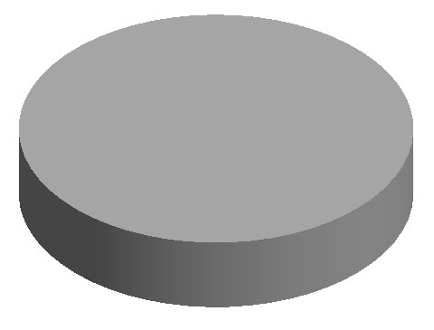

# Mechanical-engineering-configurator-MFC
Федеральное государственное автономное образовательное учреждение высшего образования «Московский политехнический университет»

Кафедра “СМАРТ технологий”

Расчетно-пояснительная записка

**«Программирование в САПР на языке C++»**

Дисциплина “Программирование в САПР”

| Студент: Натур М. В. Группа: 211-325 Вариант \_17\_ Преподаватель: Джунковский А. В. |
|--------------------------------------------------------------------------------------|

Москва 2022

Оглавление

[1. ПОСТАНОВКА ЗАДАЧИ](#1-постановка-задачи)

[2. ОПИСАНИЕ КОМАНД И ОПЕРАТОРОВ](#2-описание-команд-и-операторов)

[3. СПЕЦИФИКАЦИЯ](#3-спецификация)

[3.1 Краткая характеристика программы](#3.1-краткая-характеристика-программы)

[3.2 Определение перечня параметров](#3.1-определение-перечня )

[3.3 Разработка MFC Dialog Based Application](#_Toc7423103)

[4. СПИСОК ЛИТЕРАТУРЫ](#4-список-литературы)

# 1. ПОСТАНОВКА ЗАДАЧИ

Курсовой проект по дисциплине «Программирование в САПР» на первом семестре ее изучения состоит в разработке конфигуратора машиностроительного изделия на основании ранее изученного материала по использованию API Autodesk Inventor и построению MFС Dialog Bases Application.

Суть проекта заключается в написании приложения, позволяющего производить параметрическое построение машиностроительной детали в Autodesk Inventor.

# 2. ОПИСАНИЕ КОМАНД И ОПЕРАТОРОВ

ExtrudeFeaturePtr extrude = ftExtrude-\>MethodAddByDistanceExtent(pProfile, H1/10, kPositiveExtentDirection, kJoinOperation) – функция выдавливания. Функция принимает профиль для выдавливания (struct Profile \* Profile), расстояние выдавливания (const \_variant_t & Distance), направление выдавливания (enum PartFeatureExtentDirectionEnum ExtentDirection), тип операции (enum PartFeatureOperationEnum Operation)

CircularPatternFeature\* circFeat = pCircPatFeat-\>MethodAdd(pCollection, wax-\>GetItem(2), true, 8, "360 град", true, kIdenticalCompute) – функция задания кругового массива. Функция принимает следующие параметры: коллекция элементов для массива (ObjectCollection\* pCollection), номер оси вокруг которой будут создаваться элементы массива(wax-\>GetItem(n)), где n – номер оси, 8 – количество создаваемых объектов, “360 град” – угол на котором будет создаваться круговой массив.

ShellDefinitionPtr shptr = shells-\>MethodCreateShellDefinition(vtMissing, H5/10, kInsideShellDirection) – применение к модели функции оболочки. Для корректной работы функции необходимо задать толщину, и номер грани, которую нужно удалить.

CoilFeaturePtr Coil = Featuresptr-\>MethodAddByPitchAndHeight (pProfile_6, wax-\>GetItem(2), S1/10, H6/10, kJoinOperation, true, true, 0, true, 0, 0, true, 0, 0) – функция траектории пружины. Для ее корректной работы необходимо передать номер оси, шаг и длинну.

# 3. СПЕЦИФИКАЦИЯ

### 3.1. Краткая характеристика программы

1.  Автор: Натур М. В., студент группы: 211-325
2.  Дата создания: 25 мая 2022
3.  Программа разработана в среде Microsoft Visual Studio

### 3.2. Определение перечня параметров

Разработка конфигуратора начинается с определения перечня параметров конфигурируемой детали. В случае варианта 17 было выбрано 15 параметров. На рисунке 2 представлены параметры построения для данной детали

### 3.3. Разработка MFC Dialog Based Application

После определения параметров детали приступаем к проектированию приложения – конфигуратора. Для этого использовалось MFC Dialog Based Application из Application Wizard Microsoft Visual Studio

После создания каркаса приступаем к созданию пользовательского интерфейса (Рис. 3). При проектировании было использовано некоторое количество графических элементов «Static text», «Edit Control», «Group Box», «Edit Control», «Picture Control»

В программе были созданы переменные и связаны с «Edit Control»-ми. Также вставлено изображение с названиями параметров для задания размеров детали. Все размеры должны указываться пользователем в миллиметрах

Для работы с Autodesk Inventor необходимо подключить билблиотеку типов RxInventor.tlb, которая входит в комплект его поставки и находится в установочной директории. Подключение библиотеки происходит с помощью следующего кода:

Необходимость переименования некоторых методов связана их «пересечением» с функциями Windows API.

Перед переходом к построениям необходимо запустить Autodesk Inventor и инициализировать некоторые «главные» глобальные указатели, которые понадобятся нам в дальнейшем.

Код запуска Autodesk Inventor:

После подключения перехожу к созданию твердотельной модели

### Приступим к созданию вырезов на верхней части и создадим их круговой массив

### Создадим оболочку:

### Построение выдавливания №3:

### Построение выдавливания №4 и №5:

)

### Построение резьбы:

# 4. СПИСОК ЛИТЕРАТУРЫ

1.  Н. С. Свирневский. Разработка приложений для продуктов Autodesk: Учебное пособие. – Хмельницкий: ХНУ, 2017. –313с.
2.  Дэвид Дж. Круглински, Скотт Уингоу, Дж. Шеферд. Программирование на Microsoft Visual C++ 6.0 для профессионалов. М.: Русская редакция, 2004 г.-861 с.
3.  Александров, Э.Э. Программирование на языке C в Microsoft Visual Studio 2010 : учебное пособие / Э.Э. Александров, В.В. Афонин ; Национальный Открытый Университет "ИНТУИТ". – Москва : Интернет-Университет Информационных Технологий (ИНТУИТ), 2010. – 500 с. : ил. – Режим доступа: по подписке. – URL: https://biblioclub.ru/index.php?page=book&id=233564 (дата обращения: 05.05.2020). – Текст : электронный.
4.  Owen R. Inventor Programming in C++ [Электронный ресурс]: – Электрон. учеб. – 2019. – режим доступа к учеб.: http://www.ransensoftware.com/Inventor-CPP/
5.  Brian E. Creating Add-Ins for Inventor, 2018, v. 2, p. 8-12.
6.  Autodesk Inventor API. Первые шаги [Электронный ресурс]: – Электрон. учеб. – 2015. – режим доступа к учеб.: [https://ru.wikibooks.org/wiki/Autodesk_Inventor_API.\_ Первые_шаги](https://ru.wikibooks.org/wiki/Autodesk_Inventor_API._%20Первые_шаги)
7.  <https://docs.microsoft.com/ru-ru/cpp/?view=vs-2019>
8.  <http://cppstudio.com/>
